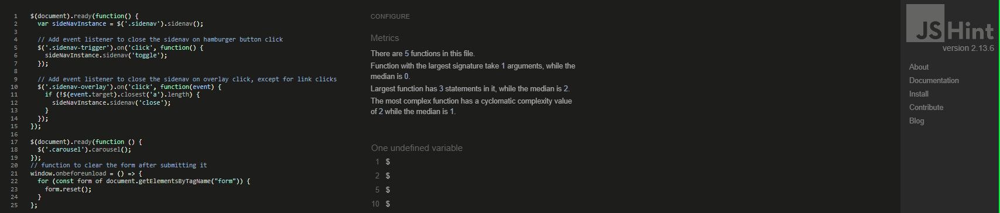

<!--> Completed <--> 
# Spectrumind
Welcome to Spectrumind, a transformative online platform dedicated to promoting pride representation, raising awareness about mental health, and fostering well-being within the LGBTQ+ community and beyond. Our project is fueled by a deep commitment to creating a more inclusive and compassionate world, where every individual feels seen, accepted, and supported.
1. Pride Representation: At Spectrumind, we strive to celebrate the rich diversity of identities within the LGBTQ+ community. Our aim is to provide a safe space where individuals can freely express their authentic selves, share their stories, and find inspiration. Through empowering narratives, vibrant artwork, and engaging content, we aim to amplify voices that have been marginalized and break down societal barriers.
2. Mental Health Awareness: We recognize the profound impact that mental health has on the well-being of individuals, especially those within the LGBTQ+ community. Spectrumind is dedicated to shedding light on the unique challenges faced by this community and providing resources, support, and information to help navigate those struggles. Our goal is to reduce stigma, foster understanding, and create a culture of empathy and acceptance.
3. Well-being and Empowerment: Spectrumind believes in the power of holistic well-being. We aim to empower individuals by providing tools, resources, and guidance that promote self-care, personal growth, and resilience. Our goal is to nurture a community where mental, emotional, and physical well-being are prioritized, leading to a stronger and more vibrant community overall.

---
<!--> To DO <--> 
## CONTENTS

* [User Experience](#user-experience-ux)
  * [User Stories](#user-stories)

* [Design](#design)
  * [Colour Scheme](#colour-scheme)
  * [Typography](#typography)
  * [Imagery](#imagery)
  * [Wireframes](#wireframes)

* [Features](#features)
  * [General Features on Each Page](#general-features-on-each-page)
  * [Future Implementations](#future-implementations)
  * [Accessibility](#accessibility)

* [Technologies Used](#technologies-used)
  * [Languages Used](#languages-used)
  * [Frameworks, Libraries & Programs Used](#frameworks-libraries--programs-used)

* [Deployment & Local Development](#deployment--local-development)
  * [Deployment](#deployment)
  * [Local Development](#local-development)
    * [How to Fork](#how-to-fork)
    * [How to Clone](#how-to-clone)

* [Testing](#testing)
  * [Manual Testing](#manual-testing)
  * [Automated Testing](#automated-testing)

* [Credits](#credits)
  * [Code Used](#code-used)
  * [Media](#media)
  * [Acknowledgments](#acknowledgments)

---
<!--> Completed <--> 
## User Experience (UX)

A group of unlikely coders with various abilities came together to produce a website dedicated to representing the LGBTQ+ community and bring awareness to others about the struggles encountered by the community throughout history and up to the current day.
The concept of the name Spectrumind developed from the idea of connecting mental wellness and the human brain and associating the light spectrum to a community defined by its rainbow colors.
Key information for the site
•	What does it mean to be a part of the LGBTQ+.
•	How can we support members of the LGBTQ+ community who suffer with feeling ostracized by society.
•	Where can we learn about the history and accomplishments of the community as well as important figures and icons.
•	What can we do to help people who struggle to understand their role in the community.
•	When do events happen throughout the year that promote awareness.

<!--> Completed <--> 
### User Stories

Client Goals
•	To be able to view the site on a range of device sizes.
•	To make it easy for people who wish to learn more about the LGBTQ+ community and make the site more accessible and understandable.
•	To make the content and information clear, easy and concise for all users.
•	To provide accessible and user-friendly links that help those in need of council.  
First Time Visitor Goals
•	I want to find out more about the LGBTQ+ community and how I can support them.
•	I want to be able to easily navigate through the website's pages, so that I can find the information I'm looking for.
•	I want to be able to find their social media profiles with ease.
Returning Visitor Goals
•	I want to find up to date information on current LGBTQ+ news and events.
•	I want to be able to find necessary links to get help or find someone to talk to, so that I can get help if needed for my mental health.
Frequent Visitor Goals
•	I want to be able to follow current events regarding the LGBTQ+ community.

## Design
<!--> Completed <--> 
### Colour Scheme

We wanted to choose colours that reflected the environment, so we have chosen a variety of blues, purples and pinks for our site.

<!--> Completed <--> 
### Typography

Google Fonts was used for the following fonts

Amatic and Josefin fonts are the main fonts used throughout the whole website with Sans Serif as the fallback font in case for any reason the font isn't being imported into the site correctly. Amatic and Josefin are clean fonts used frequently in programming, so they are both attractive and appropriate.
<!--> Completed <--> 
### Imagery

The colors were chosen to be bright and representative of the rainbow colors of the LGBTQ+ community but paler to incorporate proffesionalism in to the scheme. The pictures were chosen from the website freepik.com and found through searching by words of acceptance, support, understanding, love, thinking, and various other LGBTQ+ related phrases. The images chosen also kept close to the color scheme and draws attention to the section they are attached to.
<!--> To DO - need Edmir<--> 
### Wireframes

Add the images or links for your wireframes here.

There are lots of different options to create your wireframes - Code Institute students can access [Balsamiq](https://balsamiq.com/) as part of the course.

Some other options include [Figma](https://www.figma.com/), [AdobeXD](https://www.adobe.com/products/xd.html), [Sketch](https://www.sketch.com/?utm_source=google&utm_medium=cpc&adgroup=uxui&device=c&matchtype=e&utm_campaign=ADDICTMOBILE_SKETCH_GAD_DG_UK_T1_ALWAYS-ON_S_TRF_PROS_BRAND&utm_term=sketch&utm_source=google&utm_medium=cpc&utm_content=TOF_BRND__generic&hsa_acc=8710913982&hsa_cam=16831089317&hsa_grp=134620695759&hsa_ad=592060065319&hsa_src=g&hsa_tgt=kwd-14921750&hsa_kw=sketch&hsa_mt=e&hsa_net=adwords&hsa_ver=3&gclid=Cj0KCQjwr4eYBhDrARIsANPywCjRIFn93DMezYnsyE5Fic_8l8kynJtut0GYMU01TiohHjwziFtlH0gaAhteEALw_wcB) and [Mockup](https://apps.apple.com/us/app/mockup-sketch-ui-ux/id1527554407) to name just a few! Or you can even go old school and get those wireframes completed using pen and paper. Just snap an image of the completed wireframes to add the images to the README.

<!--> Completed <--> 
## Features

The website is comprised of four pages, three of which are accessible from the navigation menu (home page, books page & contact us page). The fourth page is a contact page that allows the user to submit their details to show support for the community.

Home Page.
•	Includes a stories of pride section that gives a short paragraph explaining the objective of the website and a Discover more link that takes you to a more in depth description of the overall goal of the website.
•	We’re here for you section to reassure our ongoing availability to those who need help.
•	A reach out section containing a short paragraph advising the user to visit the resource page and allow easy access to our contact page through a talk to us button.
History page- The navigation link for historical stories and famous figures in history:
•	A heading containing relevant question about the long historical existence of the LGBTQ+
•	Pictures containing famous historical figures that shaped our world and changed the perception in society and influenced many people during their lives. 
•	A heading of moments to be remembered 
•	Images and paragraphs pertaining to a very important time and event in the history of the LGBTQ+ community, the Stonewall Riots, and Marsha Johnson a prominent leader for the community.
Resources Page
•	A heading containing the question “How can we help each other?”
•	A section that focuses on Acceptance with a link to a guide on relevant topics and a picture of a woman hugging herself to indicate acceptance of oneself.
•	A section that focuses on Supportive with a link to a guide on relevant topics and a picture of a man giving the thumbs up to indicate support or encouragement.
•	A section that focuses on Understanding with a carousel of various links to guides and information on relevant topics and pictures of people in the pose of thought to indicate inquisitiveness.

Contact Page.
•	A heading containing “Your voice matters: LGBTQ+ Awareness” where the LGTBQ+ is in the iconic rainbow colors.
•	A let us reach out to you section, whereby the user inputs first and last name and their email with any special request and we can get back to them as soon as possible. A picture containing a relevant scene to the right of the contact section.
•	A FAQ- Question & Answers section that allows users easy access to informative sites, friendly and welcoming establishments as well as promotional sites to strengthen awareness and involvement of the user.
Future Implementations.

<!--> Completed <--> 
### General features on each page

All Pages on the website have:
•	A responsive navigation bar at the top which allows the user to navigate through the site. To the left of the navigation bar is an image of the Spectrumind logo as well as the Spectrumind text closer to the center. To the right of the navigation bar are the links to the websites pages (Home, History, Resources and Contact). To allow a good user experience of the site, the Spectrumind text is hidden with a media query on mobile devices to prevent the navigation bar looking cluttered. When viewing with mobile devices the navigation links change to a burger toggler. This was implemented to give the site a clean look and to promote a good user experience, as users are used to seeing the burger icon when on mobile devices to navigate a site.
•	A footer which contains social media icon links to Instagram, LinkedIn and github. There is also an envelope icon which takes the user to the contact us page. Icons were used to keep the footer clean and because they are universally recognisable.

<!--> Completed <--> 
### Future Implementations

•	To add a calender which shows all LGBTQ+ promotional events in different areas around the world.
•	To create an online petition section where people can sign their support
•	To create a sign up page where people could become members of Spectrumind
•	To create a newsletter option for members

<!--> Completed<--> 
### Accessibility

•	The website has been made accesible for people with impared vision.
•	The fonts were chose to be dyslexia/accessible friendly.
•	The website meets minimum contrast requirements.

## Technologies Used

<!--> Completed <--> 
### Languages Used

HTML, CSS, Python, Dockerfile, JavaScript & Procfile.

<!--> Completed <--> 
### Frameworks, Libraries & Programs Used

•	Git - For version control.
•	Github - To save and store the files for the website.
•	Materialize Framework.
•	Django.
•	Heroku - For deployment.
•	Code anywhere, git pod and VS Code - For workspaces.
•	Google Fonts - To import the fonts used on the website.
•	Font Awesome - For the iconography on the website.
•	Google Dev Tools - To troubleshoot and test features, solve issues with responsiveness and styling.
•	Favicon.io - Was used to create favicon.
•	Figma - Was used for wireframes and mockups.

## Deployment & Local Development

<!--> Need to add deployment link <--> 
### Deployment

- This site was developed in IDE (Gitpod)[https://www.gitpod.io/] and deployed to (Heroku)(https://www.heroku.com/)]
- GitHub is used for version control and hosting platform for the site.
- It was built using the Django framework.
- The site was developed by previewing the site in the browser through Port 8000 in Gitpod by running the command `python3 manage.py runserver` in the terminal.

Changes and entries to the workspace were then committed and pushed to this Github repository.

### Setting up the project in Gitpod workspace:
1. Install django by running the following command `pip3 install Django`
2. Install gunicorn for running the deployed website `pip3 install gunicorn`
3. To install postgres to support the database `pip3 install dj_database_url pyscopg2`
4. Install any other required libraries by running similar commands and add them to a requirements.txt file so that Heroku will install them at deployment. This is done by running `pip3 freeze --local > requirements` in the terminal and can be run again when necessary to add further libraries.
5. Create your Django project by entering the following command: `django-admin startproject < YOUR PROJECT NAME >`
6. To create a django app, run `python manage.py startapp < YOUR APP NAME >`
7. Add the name of the newly created app to "INSTALLED_APPS" in settings.py.
8. Development of apps can begin from here.
### Deploying to Heroku
1. Once logged into Heroku, choose the option 'Create App'.
2. Attach the database in the Resources tab in Add-ons. Search for 'Heroku Postgres' and add.
3. In your workspace, create an env.py file which will store environment variable and add it to .gitignore so as not to expose any sensitive information publicly in Github.
4. Store your 'SECRET_KEY' and 'DATABASE_URL' here and import into settings.py
5. In Heroku, under settings, choose 'Reveal Config Vars and add your 'SECRET_KEY' and 'DATABASE_URL'.
6. Migrate to the database in Gitpod using `python manage.py makemigrations` followed by `python manage.py migrate`
7. Add your Heroku app URL to "ALLOWED_HOSTS" in settings.py.
8. Create a Procfile in the top level of the directory and add `web: gunicorn projectname.wsgi` so Heroku knows how to run the project.
### Initial deployment:
1. Push any changes to Github after connecting your Heroku app to your repository.
2. Add DISABLE_COLLECTSTATIC with a value of 1 to Heroku config vars.
3. Select Github in Deployment method and choose 'Deploy branch' under Manual Deploy, ensuring your main branch is chosen.

### Local Development

<!--> Completed <--> 
#### How to Fork

To fork the repository:

1. Log in (or sign up) to Github.
2. Go to the repository for this project, [spectrumind-hackathon-2023](https://github.com/Edmir-Demaj/hackathon-june-23).
3. Click the Fork button in the top right corner.

<!--> Completed <--> 
#### How to Clone

To clone the repository:

1. Log in (or sign up) to GitHub.
2. Go to the repository for this project, [spectrumind-hackathon-2023](https://github.com/Edmir-Demaj/hackathon-june-23).
3. Click on the code button, select whether you would like to clone with HTTPS, SSH or GitHub CLI and copy the link shown.
4. Open the terminal in your code editor and change the current working directory to the location you want to use for the cloned directory.
5. Type 'git clone' into the terminal and then paste the link you copied in step 3. Press enter.

## Testing

A number of manual tests were carried out on this project by all members:
 
### Manual Testing

**`Home, History, Resources, Contact Page`** 

| Feature | Expected Outcome | Testing Performed | Result | Pass/Fail |
| --- | --- | --- | --- | --- |
| Navbar links | Redirects the user to other pages on the site | Clicked on the link | The correct page is open and displayed | ✅ |
| External links | Redirects the user to external third part site | Clicked on the link | Successfully directed the user to the correct external site | ✅ |
| Contact form | Show validation message if user input wrong or empy data | Filled the form with wrong characters, empty strings and ints | Received correct required messages | ✅ |
| Contact form | Receive user input data in the database | Filled the form and clicked submit | Received the input data in our email | ✅ |
| All buttons - hover effect | When hovered over, all buttons should change color or have zoom animation to indicate that the button is hovered | Hovered over each button on the webpage | Each button displayed the correct style/animation when hovered over | ✅ |

**`Nav Section`**

| Feature | Expected Outcome | Testing Performed | Result | Pass/Fail |
| --- | --- | --- | --- | --- |
| Navbar links | Redirects the user to other pages on the site | Clicked on the link | The correct page is open and displayed | ✅ |

**`Footer Section`**

| Feature | Expected Outcome | Testing Performed | Result | Pass/Fail |
| --- | --- | --- | --- | --- |
| Navbar links | Redirects the user to other pages on the site | Clicked on the link | The correct page is open and displayed | ✅ |

### Automated Testing
**`Lighthouse`** 

Website has been tested with google lighthouse and the result is as below.

  

**`JSHint`** 

  

&nbsp;

## Credits

- All images were taken using 
- Inspiration was taken from
- API for submit form was taken from

### Code Used

If you have used some code in your project that you didn't write, this is the place to make note of it. Credit the author of the code and if possible a link to where you found the code. You could also add in a brief description of what the code does, or what you are using it for here.

###  Media

If you have used any media on your site (images, audio, video etc) you can credit them here. I like to link back to the source where I found the media, and include where on the site the image is used.
  
###  Acknowledgments

- Thank you to all the team member for the hard work and cooperation.
  - **Edmir Demaj** - [GitHub](https://github.com/Edmir-Demaj), [LinkedIn](https://www.linkedin.com/in/edmir-demaj-42a501196)
  - **Jody Murray** - [GitHub](https://github.com/JodyMurray), [LinkedIn](https://www.linkedin.com/in/jody-murray-4b6818234/)
  - **Ignas Pilybas** - [GitHub](https://github.com/ignasvilkas), [LinkedIn](https://www.linkedin.com/in/ignaspilybas/)
  - **Kim Bergstrom** - [GitHub](https://github.com/KimBergstroem), [LinkedIn](https://www.linkedin.com/in/kim-bergstrom-47704b5b/)
  - **Mark Young** - [GitHub](https://github.com/Markyjay), [LinkedIn](https://www.linkedin.com/in/mark-young-4a90ab15/)

This section will call out each team member for a particularly valuable contribution to the project
